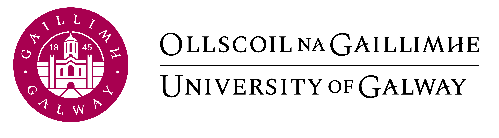
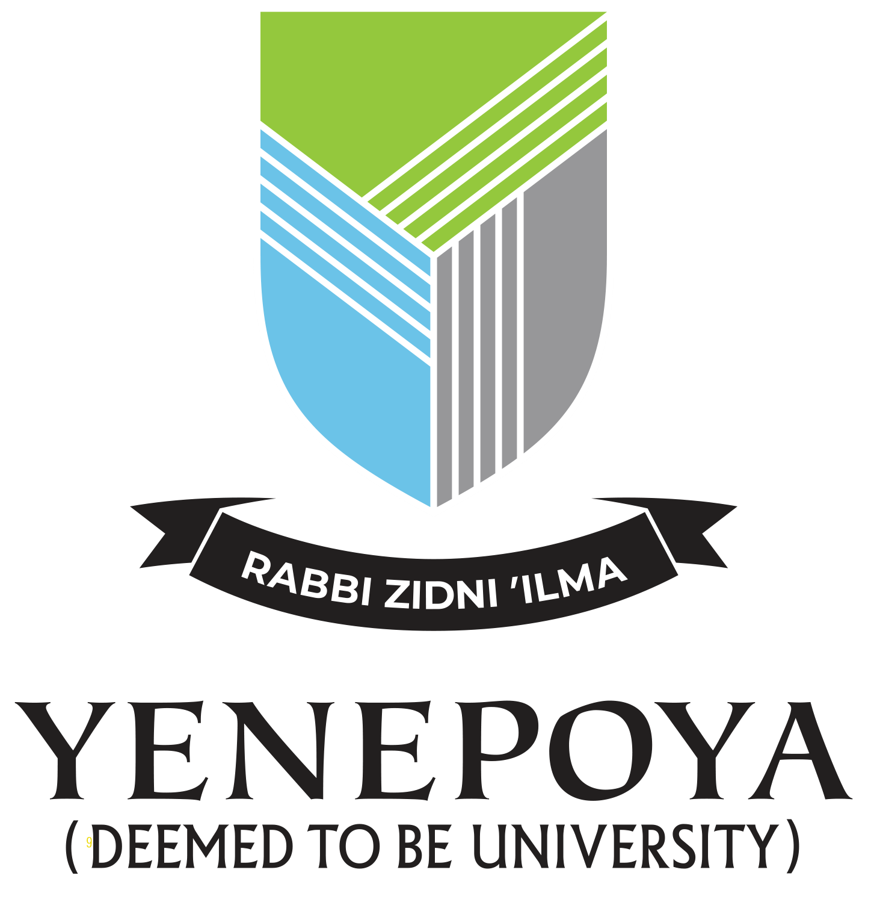

# [DravidianCodeMix 2025](https://dravidian-codemix.github.io/2025/) @ [FIRE 2025](https://fire.irsi.org.in/fire/2025/home)

**Offensive Language Identification in Dravidian Code-Mixed Languages**

This repository hosts the website for the DravidianCodeMix 2025 shared task, which focuses on detecting offensive language in code-mixed Dravidian language text (Tamil-English, Malayalam-English, Kannada-English, and Tulu-English).

## About the Shared Task

Code-mixing is common in multilingual communities, and standard monolingual NLP models often fail on such data. This shared task provides a gold-standard dataset of social media comments (collected from YouTube) annotated into four classes:

- **Not Offensive (NO)** – Content without offensive elements.
- **Offensive Untargeted (OU)** – Offensive content not directed at a specific individual or entity.
- **Offensive Targeted (OT)** – Direct attacks on an individual or group (hate speech, caste/gender-based abuse, etc.).
- **Not in Target Language (NT)** – Content not in the target Dravidian language.

This is notably the **first shared task on offensive language detection in Tulu**.

## Repository Structure

```
├── index.html          # Landing page
├── overview.html       # Task overview and description
├── about.html          # About the shared task
├── dataset.html        # Dataset details
├── dates.html          # Important dates / timeline
├── keynote.html        # Keynote speaker information
├── organizers.html     # Organizer profiles
├── submission.html     # Submission guidelines
├── style.css           # Site stylesheet
├── images/             # Logos and organizer photos
└── dravidian2025.zip   # Supplementary data
```

## Categories

- Natural Language Processing (NLP)
- Machine Learning (ML)

## Contact

- **Email:** dravidiancodemixed@gmail.com | bharathiraja.akr@gmail.com

## Previous Editions

- [2020](https://dravidian-codemix.github.io/2020/)
- [2021](https://dravidian-codemix.github.io/2021/index.html)
- [2022](https://sites.google.com/view/dravidiancodemix-2022/home)
- [2023](https://sites.google.com/view/dravidian-codemix-fire-2023/home)
- [2024](https://sites.google.com/view/dravidian-codemix-fire2024/home)

## Affiliated Institutions

<p align="center">
  &nbsp;&nbsp;&nbsp;
  &nbsp;&nbsp;&nbsp;
  &nbsp;&nbsp;&nbsp;
  
</p>

---

© 2025 DravidianCodeMix Track. All rights reserved.
